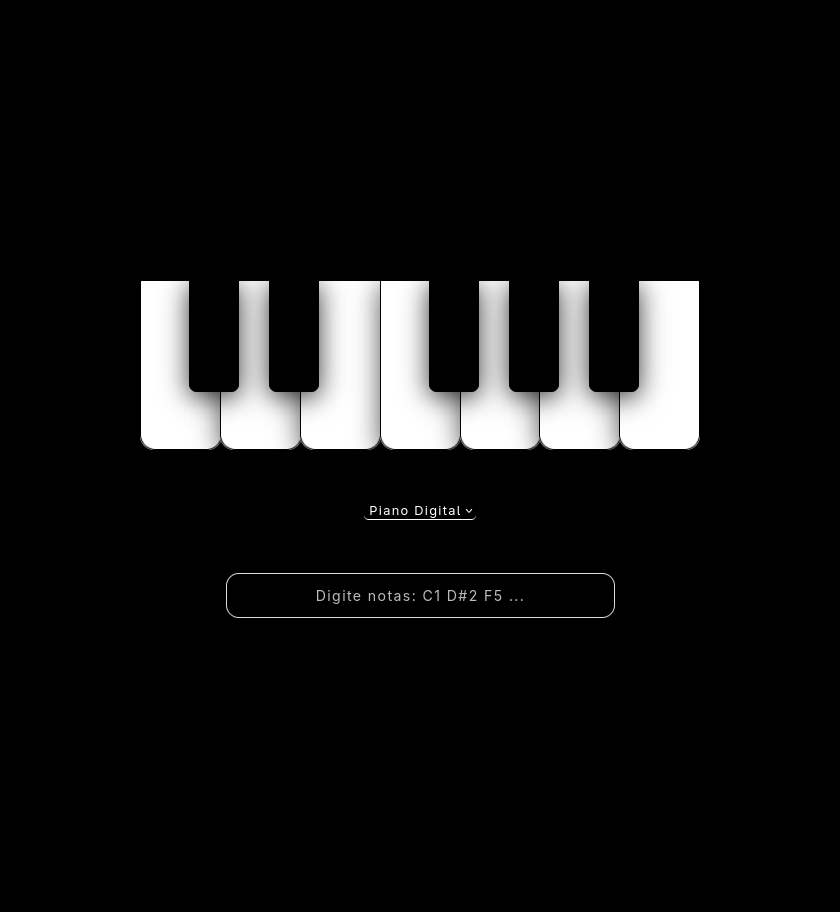

# 🎹 PianoREACT

Um site interativo e minimalista feito em **React** que simula um teclado musical.  
Digite sequências como `C D E F` e ouça as notas **Dó, Ré, Mi, Fá** sendo tocadas.  
Ideal para testar no navegador ou usar como base para projetos de áudio com React.

---

## 🎮 Toque!

Clique nas teclas ou digite notas na caixa de texto (ex: `E5 D#5 E5 D#5 E5 B4 D5 C5 A4`).  
Escolha o timbre no seletor acima da caixa de texto.

### 🎵 Exemplos de músicas:

**Für Elise**  
`E5 D#5 E5 D#5 E5 B4 D5 C5 A4 C4 E4 A4 B4 E4 G#4 B4 C5 E4 E5 D#5 E5 D#5 E5 B4 D5 C5 A4`

**Marcha Imperial**  
`G4 G4 G4 D#4 A#4 G4 D#4 A#4 G4 D5 D5 D5 D#5 A#4 F#4 D#4 A#4 G4 G5 G4 G4 G5 F#5 F5 E5 D#5 F5 A#4 D#5 G4 A#4 D#5 G4`

**Parabéns pra Você**  
`C4 C4 D4 C4 F4 E4 C4 C4 D4 C4 G4 F4 C4 C4 C5 A4 F4 E4 D4 A#4 A#4 A4 F4 G4 F4`

**Ode à Alegria**  
`E4 E4 F4 G4 G4 F4 E4 D4 C4 C4 D4 E4 E4 D4 D4 E4 E4 F4 G4 G4 F4 E4 D4 C4 C4 D4 E4 D4 C4 C4`

---

## 🧠 Funcionalidades

- Entrada de texto para notas musicais (`C D E F G A B`)
- Conversão automática para sons reais de piano
- Interface minimalista com fundo preto
- Estilo responsivo usando **TailwindCSS**
- Suporte a diferentes timbres

## 🚀 Acesse o Projeto

👉 [Versão online (Vercel)](https://piano-react-okan-ovcgm6xfw-emanuel-martins-projects.vercel.app/)

## 📦 Tecnologias Utilizadas

- React.js
- Web Audio API
- HTML5 + CSS3

## 📄 Licença

Este projeto é **open-source** e livre para uso e modificação.

---

Desenvolvido com ❤️ por [EmanueL Martins](https://github.com/MartinesEmanuel)

